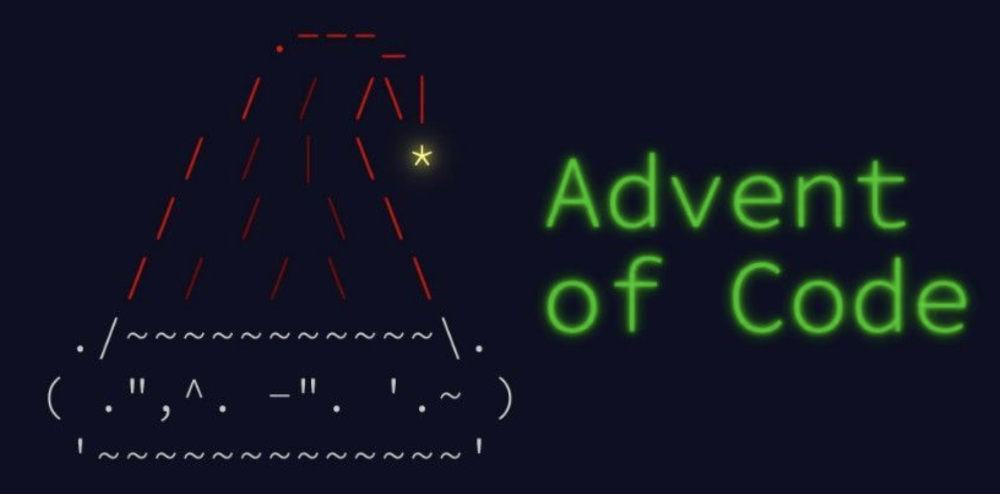

# The Advent of Code 2021

The advent of code are 25 little programming puzzles, that can be solved in the programming language of your choice.

The advent calendar with the puzzles can be found [here](https://adventofcode.com/2021). I will add the description and input data for each day to this repo when they are available.

Join the fun, sign up for a day or commit your solutions spontaneously and let's try to solve as many puzzles as possible.

     

1. Day - Silvia
2. Day - 
3. Day -
4. Day -
...
